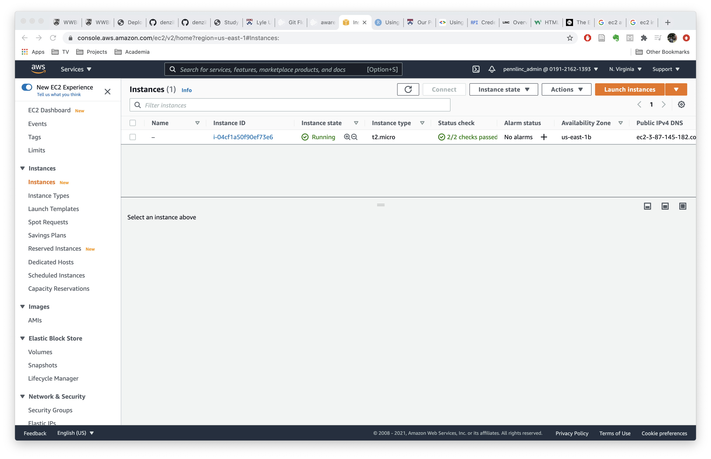

# Amazon EC2 Instances

In order to collect passive data, some machine in the cloud needs to be
running constantly and minimally preprocessing it for storage. This is where
Amazon's EC2 product comes in. EC2 stands for _Elastic Compute Cloud_ and is one
of Amazon's many AWS products.

Put simply, an _EC2 instance_ is a virtual server in the cloud
for running applications on the Amazon Web Services (AWS) infrastructure. This
means it can run in the background and be accessed via the internet. For our
purposes, the EC2 instance connects to AWARE and manages the running of the
_AWARE dashboard_.

## Set Up

To set up an EC2 instance, the lab will need an Amazon Web Services account.
This can be set up by the PI (who will likely reach out to IT and the program manager)
and once this is configured, you'll be able to log in to AWS and see a page similar to the one below:

Once this is complete, you'll need to set up an instance. These instances are
somewhat like Docker images, in that they can be deployed on individual machines
in a containerized way, and they can be shared. Fortunately for us, we were able
to have a pre-configured instance _cloned_ to our AWS for us to use. If you
don't have this option, you'll need to build the instance yourself. There are
instructions for how to do that in [this document](assets/Aware_Dashboard_Install_Instructions_Ubuntu_18.pdf).
