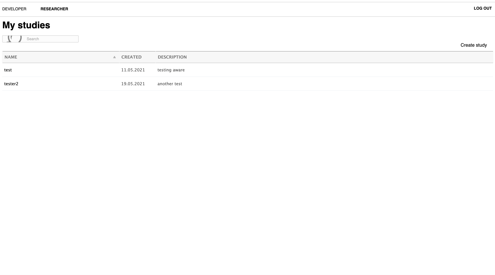
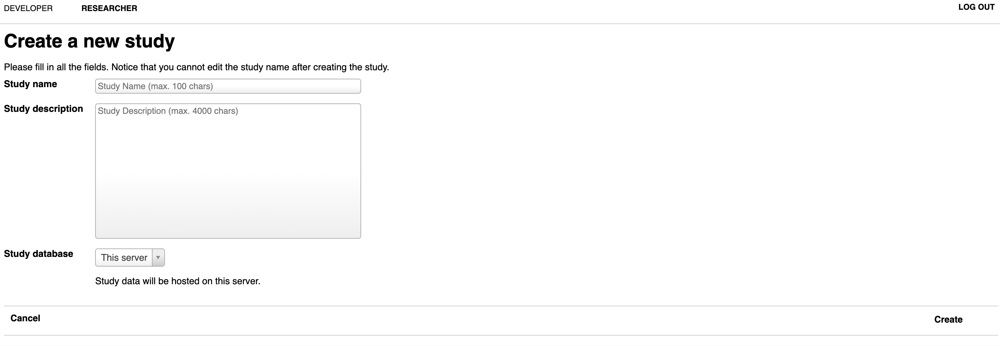
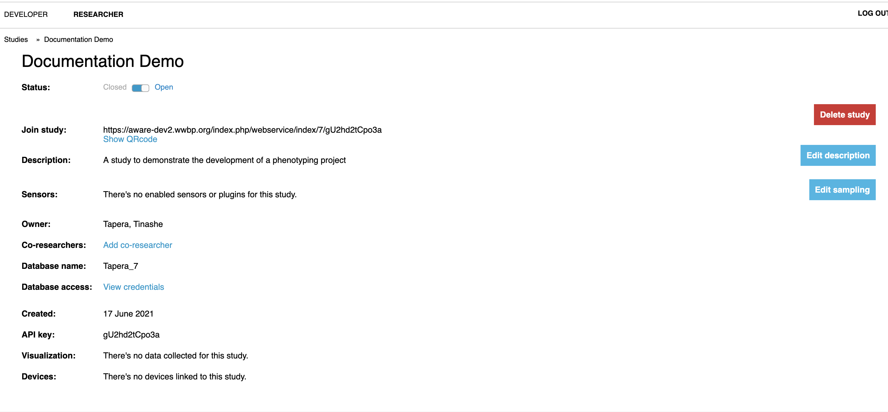
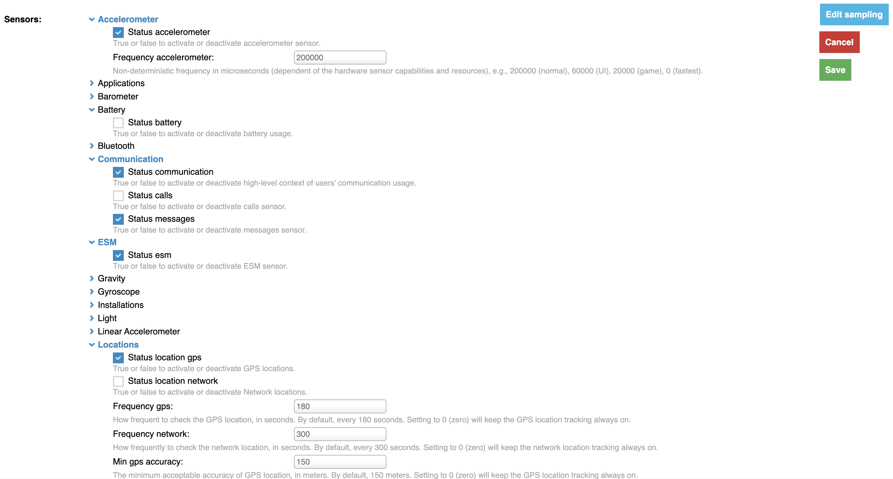
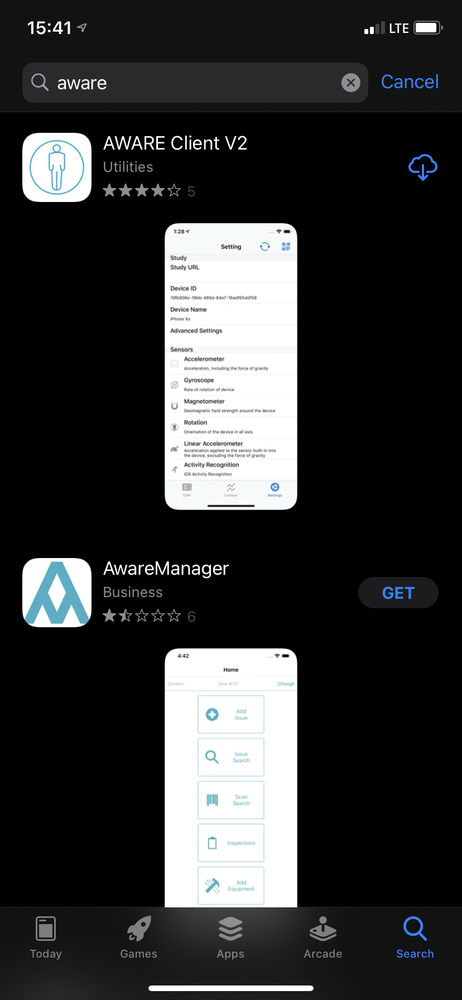
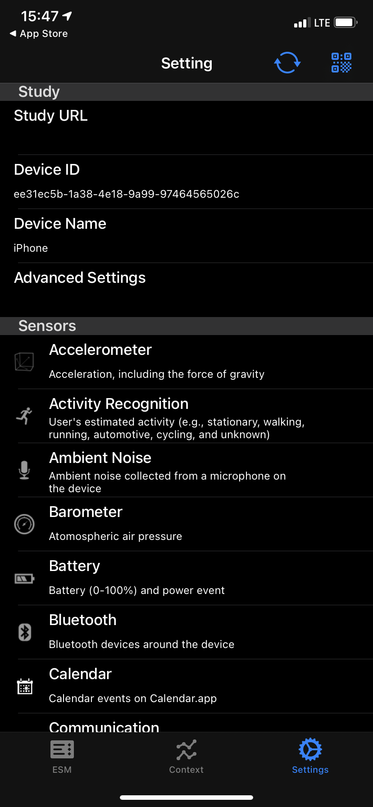

# The AWARE Framework

---
AWARE is a framework dedicated to instrument, infer, log and share mobile context information by sensor instrumentation, for application developers, researchers and smartphone users. AWARE captures hardware-, software-, and human-based data from smartphones. The data is then analyzed using AWARE plugins. They transform data into information you can understand.

<a href="https://awareframework.com/">— AWARE Framework Website</a>

---

In short, AWARE is a software suite that handles the collection of
mobile data. It was developed by the
[World Well-Being Project](http://www.wwbp.org/), of which UPenn is a
collaborator with Lyle Unghar. If you want to set up a mobile phenotyping project at
UPenn, their group is who to reach out to.

AWARE presents to participants (users) as a mobile app that
can be installed on participants' devices by sharing a URL. Once installed,
the app monitors different data streams depending on what the _study_ has
configured.

## Studies & The AWARE Dashboard

Studies are configured by developers in the lab. Once you've approved a
project with WWBP, they will set up an AWARE _site_ for you. This will be
the management home of your project that you can access online — the _AWARE Dashboard_. In our case,
the URL we were able to visit for managing studies is [https://aware-dev2.wwbp.org/index.php/](https://aware-dev2.wwbp.org/index.php/). Once your site is online,
you may sign in with (in our case) a Google account, which will take you to this
landing page:

## Creating Study

To get started, click `Create Study`. You'll be directed to this page:

Fill in the relevant details, and for the `Study Database` select `This server`
(we'll talk more about servers in the Amazon EC2 section, but this basically
means that whatever _site_ was configured for your use will send its data
to the machine created for you).

From here, the study will be available as below:

## Configuring Studies

At this point, you will likely want to figure out how to add data streams to
collect. To add a data stream, simply click the `Edit sampling` button on the
right, and click the data type you'd like to collect. Click the toggle button
to activate data collection on the sensor for that data type, and manipulate the sampling
(how many times per interval the app grabs data). In this example, we'll collect
a couple of different streams, including accelerometer, battery, texts,
communication contexts, location, and screen time.

For a look at all of the available data streams and descriptions of what they
are/do, see AWARE's [sensor documentation](https://awareframework.com/sensors/).

## Adding Participant Devices

Now you have a study, and you know what data you want to collect in it. To add
participants to the study, have them download the AWARE_V2 application first. In
iOS, it comes up first in the App Store as AWARE_V2:

Now, simply share the URL available under `Join study`, or
allow users to scan the QR code. Users can find the QR code scanner under `Settings` in the top right hand corner:

Whenever a user has a problem on their device, they may just need to re-sync
with the server. To do this, they can click the sync arrows in the top right.

## Collecting Active Data

Once a user has gone through the above, the mobile device will begin collecting
_passive_ data at whatever sampling rate you configured. But if you wanted to
collect _active_ data (e.g., have users answer a question or respond to a survey),
you'll need to configure an [ESM](https://dl.acm.org/doi/10.1145/3123988).

Once any number of devices are connected, you'll notice a change to the bottom
of the screen of the AWARE Dashboard. From here, you can configure an ESM to go
out to users:
